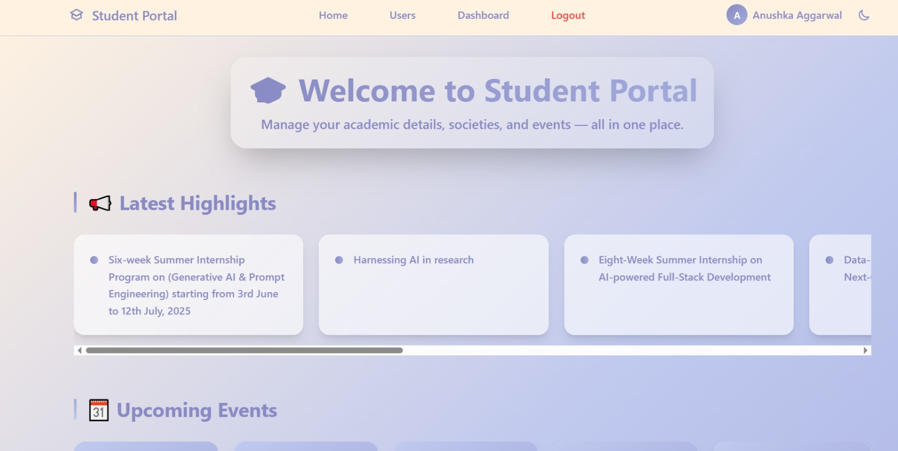
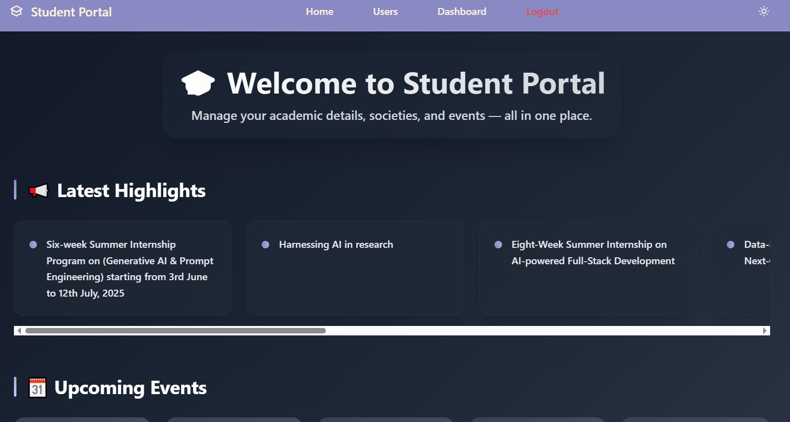

#  Student Portal

A modern, responsive web application built with **React** and **Tailwind CSS** that helps students manage academic activities, track events, view societies, and stay organized all in one place.

---

## Features Implemented

-  **Authentication System**  
  - Dummy login with email & password  
  - Signup page to register new users  
  - LocalStorage-based auth  
  - Redirect to dashboard after login  
  - Show/hide password toggle  
  - Auto login redirect if already logged in  

-  **Sticky Navbar**  
  - Includes: Home | Users | Dashboard | Logout  
  - Displays current logged-in user's name  
  - Responsive and dark-mode supported  

-  **Home Page**  
  - Welcome section with gradient background  
  - Scrollable sections for upcoming events, societies, and tasks  
  - Latest campus highlights with cards  
  - Personalized pending tasks  

-  **Users Page**  
  - Fetches data from `https://jsonplaceholder.typicode.com/users`  
  - Displays Name, Email, Phone, and Website  
  - Responsive layout with loading & error states  

-  **Dashboard Page**  
  - Shows dummy academic stats (GPA, Attendance, Subjects)  
  - Uses responsive cards with Tailwind  

-  **Dark Mode Support**  
  - Toggle button for switching between light and dark mode  

-  **Logout**  
  - Clears user from localStorage  
  - Redirects back to login page  

---

## Screenshot

---

## What I Learnt & Found Challenging

- Learned how to set up Tailwind CSS in a React project manually
- Understood React routing and `useNavigate()` logic for authentication
- Practiced managing dark mode and persisting state using `localStorage`
- Found styling scrollable components and responsive layouts using Tailwind very intuitive
- Learned how to fetch and render real time data from public APIs with loading/error handling
- Faced and fixed Tailwind + PostCSS plugin compatibility issues

---

## Live Site

Hosted on [Vercel](https://vercel.com)  
URL: https://student-portal-omega-nine.vercel.app/

---

